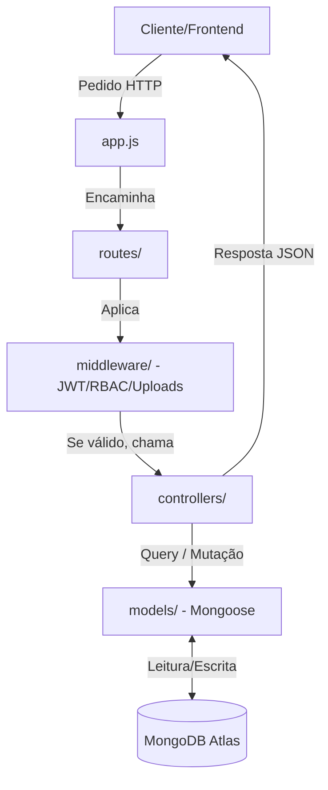

# 🌿 Detalhe Técnico e Arquitetura do EcoGest Backend

Este documento serve como guia completo de engenharia para o backend do **EcoGest**. Explica detalhadamente o que a aplicação faz, como está estruturada, o propósito de cada componente e a lógica implementada nos diferentes ficheiros de código.

---

## 📌 1. O que o Backend Faz (Propósito Geral)

O backend do EcoGest é uma **REST API** robusta desenvolvida em **Node.js** com a framework **Express**. A sua principal função é centralizar a lógica de negócio do programa Eco-Escolas, servindo de base de dados e controlador lógico para a aplicação frontend.

Ele gere:
1. **Utilizadores e Permissões (RBAC)**: Registo, login, rotação de sessões seguras e hierarquia de acesso.
2. **Projetos Eco-Escolas**: Organização das atividades e reuniões em anos letivos.
3. **Atividades e Participantes**: Planeamento, controlo de estados, inserção de imagens de evidência, e inscrições de alunos ou convidados externos.
4. **Conselho Eco-Escolas e Reuniões**: Agendamento de reuniões, atas oficiais e gestão de documentos anexados (como PDFs de convocatórias).
5. **Propostas e Ideias**: Fluxo em que membros propõem ações que os coordenadores podem aprovar ou rejeitar.
6. **Auditorias Ambientais Dinâmicas**: Questionários estruturados divididos por temas (Água, Energia, Resíduos) com respostas e pontuações para medir a evolução sustentável da escola.
7. **Administração e Segurança**: Painel de estatísticas, rate limiting de segurança e backups do sistema.

---

## ⚙️ 2. Como Faz (Arquitetura e Fluxo de Pedidos)

A API segue uma arquitetura descentralizada inspirada no padrão **MVC (Model-View-Controller)** (com a View delegada para a aplicação cliente React).

O fluxo de processamento de um pedido HTTP é o seguinte:

1. **Ponto de Entrada (`app.js`)**: Onde a aplicação Express é iniciada, os middlewares globais (CORS, Express JSON, rotas estáticas) são declarados, a conexão com a base de dados é estabelecida e o servidor é posto à escuta na porta especificada.
2. **Camada de Rotas (`routes/`)**: Declara os endpoints públicos e protegidos e liga-os aos middlewares de verificação e aos controladores adequados.
3. **Camada de Middlewares (`middleware/`)**: Filtra os pedidos. Verifica tokens de acesso JWT, analisa se o utilizador tem permissões de acesso ao recurso (RBAC), e executa operações transversais de segurança ou upload de ficheiros.
4. **Camada de Controladores (`controllers/`)**: Contém a inteligência do sistema. Recebe os dados validados do pedido, realiza cálculos, acede à base de dados através dos modelos Mongoose e gera a resposta HTTP adequada com o código de estado correto (ex: `200 OK`, `201 Created`, `400 Bad Request`, `403 Forbidden`, `429 Too Many Requests`).
5. **Camada de Modelos Mongoose (`models/`)**: Mapeia as coleções do MongoDB utilizando esquemas fortemente estruturados com validações e tipos de dados definidos.

---

## 📂 3. Estrutura de Pastas e Ficheiros

A estrutura de ficheiros do backend está organizada de forma modular:

*   📁 **`config/`**
    *   `database.js`: Estabelece a ligação com o MongoDB via Mongoose, configurando tempos limites de seleção do servidor.
*   📁 **`controllers/`**
    *   *Lógica de processamento de dados e respostas da API.*
*   📁 **`docs/`**
    *   `swagger.json`: Ficheiro de documentação OpenAPI/Swagger contendo a especificação técnica de todas as rotas da API.
*   📁 **`middleware/`**
    *   *Filtros intermédios de segurança e validação.*
*   📁 **`models/`**
    *   *Definição de coleções do MongoDB e exportação unificada em `index.js`.*
*   📁 **`routes/`**
    *   *Mapeamento dos caminhos HTTP aos controladores.*
*   📁 **`uploads/`**
    *   *Diretório físico onde são guardados os PDFs de atas de reuniões e fotografias de atividades.*
*   📁 **`utils/`**
    *   Componentes auxiliares (ex: configurações de armazenamento local com o Multer).

---

## 🔒 4. Mecanismos de Segurança e Lógica Central

### A. Rotação Dinâmica de JWT (Access & Refresh Tokens)
Localizado em [`controllers/users.js`](file:///Users/mesquita/ESMAD/webp2/EcoGest/backend/controllers/users.js) e [`middleware/auth.js`](file:///Users/mesquita/ESMAD/webp2/EcoGest/backend/middleware/auth.js):
*   **Access Token**: Token JWT assinado com o segredo da aplicação que expira em **15 minutos** (`JWT_EXPIRES_IN`). Transporta o `id` e a função (`role`) do utilizador, sendo enviado no cabeçalho `Authorization: Bearer <token>`.
*   **Refresh Token**: Token aleatório criptográfico forte (`crypto.randomBytes`) gerado no login, guardado na base de dados (`RefreshToken`) e válido por **7 dias**.
*   **Mecanismo de Rotação**: Para renovar o acesso sem forçar o utilizador a reintroduzir as credenciais, o cliente consome o endpoint `/refresh` enviando o refresh token. O backend valida a existência e a data de expiração do token na base de dados. Se estiver correto, **apaga o refresh token antigo** e emite um par novinho em folha (novo access token + novo refresh token). Isto protege o sistema contra ataques de repetição se o token for intercetado.

### B. Rate Limiting de Autenticação no MongoDB
Localizado em [`controllers/users.js` (Função Login)](file:///Users/mesquita/ESMAD/webp2/EcoGest/backend/controllers/users.js#L43-L85):
*   Sempre que um pedido de login é efetuado, o backend regista uma entrada na coleção `AuthLog` com o IP de origem e o resultado (sucesso ou falha).
*   Antes de processar as credenciais, o backend pesquisa na coleção quantos logs de tentativa de login existem para aquele IP específico nos **últimos 60 segundos**.
*   Se o contador ultrapassar o limite (padrão: 5 tentativas), o pedido é rejeitado de imediato com **`HTTP 429 Too Many Requests`**, bloqueando ataques de força bruta antes mesmo de consultar/comparar passwords na base de dados.

### C. Controlo de Acesso Baseado em Funções (RBAC)
Localizado em [`middleware/roles.js`](file:///Users/mesquita/ESMAD/webp2/EcoGest/backend/middleware/roles.js):
*   A fábrica de middleware `authorize(...roles)` recebe a lista de cargos autorizados (ex: `authorize('admin', 'coordinator')`).
*   Se a função do utilizador autenticado (`req.user.role`) não estiver contida na lista permitida, o middleware bloqueia a requisição retornando **`HTTP 403 Forbidden`**.
*   **Funções Existentes**:
    *   `admin`: Acesso total a configurações, auditorias, registos de sistema e gestão de todos os utilizadores.
    *   `coordinator`: Gere projetos anuais, avalia propostas, agenda reuniões e atualiza o estado de atividades.
    *   `secretary`: Auxilia no agendamento e redige atas de reuniões do conselho.
    *   `council_member`: Elementos do conselho que propõem atividades e registam atas.
    *   `user`: Alunos e professores em geral que visualizam atividades públicas e se inscrevem nelas.

---

## 🛠️ 5. O que Faz Cada Controlador (`controllers/`)

Cada controlador isola as responsabilidades da sua respetiva entidade:

*   **`users.js`**:
    *   `register` e `login`: Controla o onboarding e autenticação dos utilizadores.
    *   `refresh` e `logoutSession`: Controlo de ciclo de vida das sessões ativas.
    *   `getMe`, `updateMe`, `updateMyStatus`: Permite aos utilizadores lerem e editarem o seu próprio perfil ou desativarem a sua própria conta voluntariamente.
*   **`admin.js`**:
    *   `getDashboard`: Consolida estatísticas agregadas de atividades planeadas, ativas e completas e calcula as participações mensais dos últimos 6 meses para desenhar gráficos analíticos no frontend.
    *   **Gestão Hierárquica de Utilizadores**: Controla a criação e modificação de contas de utilizador. Possui uma regra de validação de limite *(Boundary Check)*: utilizadores que não sejam `admin` não podem criar ou alterar perfis de coordenadores ou administradores, nem atribuir cargos acima do seu nível de permissão.
*   **`activities.js`**:
    *   Gere a criação e listagem pública/privada das atividades escolares, filtradas por projeto ou área ecológica.
    *   Controle de participação de membros inscritos ou convidados através do modelo de relacionamento `ActivityParticipant`.
*   **`proposals.js`**:
    *   Gere o fluxo de propostas de ações sustentáveis vindas da comunidade escolar.
    *   O coordenador avalia, adiciona observações (`reviewNote`) e o sistema gera automaticamente uma atividade no calendário caso a proposta seja marcada como aprovada (`approved`).
*   **`meetings.js`**:
    *   Permite marcar reuniões do conselho ecológico e fazer o upload direto da agenda ou ata (através do Multer).
*   **`audits.js`**:
    *   Controla a auditoria ecológica anual.
    *   Contém a lista de perguntas associadas a temas e permite guardar respostas e pontuações dinâmicas de modo a criar relatórios de evolução sustentável ano a ano.
*   **`backups.js`**:
    *   Permite a exportação e importação física das coleções do sistema em formato JSON por utilizadores com permissão de administrador.

---

## 🗄️ 6. Explicação dos Modelos de Dados (Mongoose `models/`)

Todos os modelos estão definidos na pasta `models/` e representam as coleções do MongoDB:

1.  **`User`**: Nome, email (índice único, minúsculas), password encriptada, função (`role`, padrão: `user`) e estado (`active`/`inactive`).
2.  **`Project`**: Define o ano letivo das Eco-Escolas (ex: 2026), coordenador responsável, estado (active/finished) e nível da medalha obtida (gold, silver, etc.).
3.  **`ProjectArea`**: Tópicos ou áreas ecológicas de incidência (ex: Água, Resíduos, Energia).
4.  **`Activity`**: Nome da atividade, descrição, datas de início/fim, localização, recursos necessários, estado (`planned`, `active`, `completed`), visibilidade (`public`/`private`) e o projeto anual a que pertence.
5.  **`ActivityParticipant`**: Associa um utilizador registado ou convidado externo (por nome/email) a uma determinada atividade.
6.  **`ActivityImage`**: Fotografias de evidências recolhidas durante as atividades Eco-Escolas.
7.  **`CouncilMember`**: Lista de membros do conselho associados a cada projeto anual, especificando a função desempenhada no conselho (Presidente, Secretário, Membro).
8.  **`Proposal`**: Título, descrição, área ecológica, recursos recomendados e o estado da proposta (`pending`, `approved`, `rejected`), com ligação ao utilizador proponente.
9.  **`Meeting`**: Registo de reuniões do conselho com nome da reunião, descrição da ordem de trabalhos e data/hora.
10. **`MeetingDocument`**: Ficheiros PDF associados a reuniões (atas, agendas convocatórias). Guarda a URL do ficheiro guardado localmente e o utilizador que realizou o upload.
11. **`Report`**: Relatórios anuais ou setoriais agregados.
12. **`Backup`**: Histórico de backups criados no painel de controlo, contendo o caminho físico para o JSON exportado.
13. **`AuthLog`**: Logs detalhados de login (IP, navegador/user-agent, se teve sucesso ou falhou).
14. **`SystemLog`**: Log de auditoria interna para registar ações críticas executadas no backend.
15. **`AuditQuestion`**: Banco de perguntas estruturadas para o questionário de auditoria ecológico escolar.
16. **`AuditResponse`**: Guarda as respostas fornecidas para as perguntas de auditoria e a respetiva pontuação para o ano corrente.
17. **`RefreshToken`**: Repositório de tokens ativos para suporte de rotação de login.

---

## ⚡ 7. Resumo Tecnológico do Servidor

*   **Runtime**: Node.js v20+ (Ambiente estável LTS).
*   **Base de Dados**: MongoDB (Ligação por MONGODB_URI) via ODM Mongoose.
*   **Segurança**: Hashing `bcryptjs`, criptografia `crypto` e tokens `jsonwebtoken`.
*   **Upload de Ficheiros**: Middleware `multer` configurado para salvar ficheiros de forma estruturada no disco com nomes únicos baseados em carimbos temporais (timestamps).
*   **Documentação**: `swagger-ui-express` servido diretamente na rota `/api-docs`.
